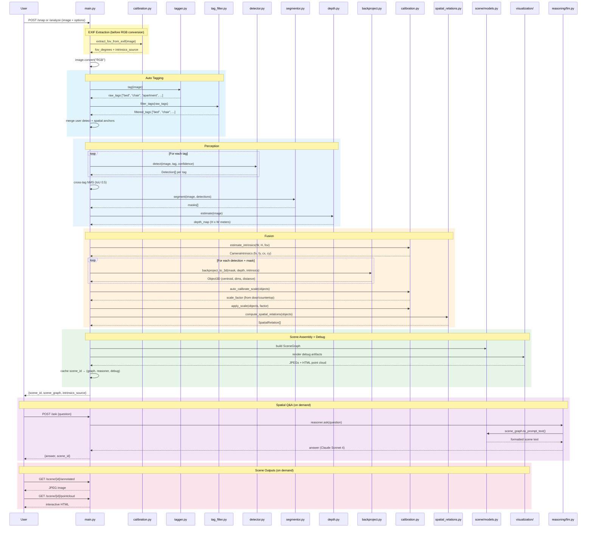
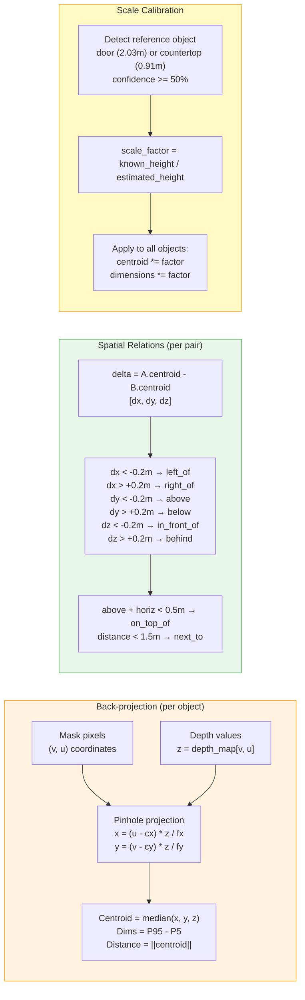
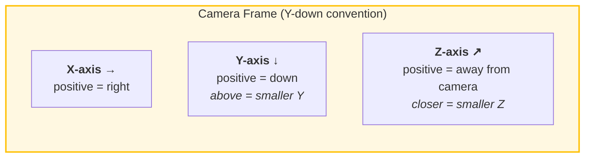

# Splat Memory — Pipeline Diagram

## Full System Pipeline

```mermaid
flowchart TB
    subgraph INPUT["INPUT"]
        IMG["Single Image<br/>JPEG / PNG / HEIC"]
        DETECT["detect=&quot;chair,lamp&quot;<br/><i>(optional extra objects)</i>"]
        FOV["fov_degrees / focal_length_35mm<br/><i>(optional override)</i>"]
    end

    subgraph EXIF["EXIF EXTRACTION"]
        EX["<b>Extract FOV from EXIF</b><br/><code>calibration.py</code><br/>FocalLengthIn35mmFilm → FOV<br/>Priority: user override > EXIF > 70° default"]
    end

    subgraph TAGGING["AUTO TAGGING &nbsp; <code>perception/</code>"]
        direction TB
        RAM["<b>RAM++ Tagger</b><br/><code>tagger.py</code><br/>Discover object categories<br/>from image content"]
        FILT["<b>Claude Tag Filter</b><br/><code>tag_filter.py</code><br/>Remove non-physical tags<br/>(room, apartment, etc.)"]
        MERGE["<b>Merge Tags</b><br/>filtered_tags<br/>+ user detect objects<br/>+ spatial anchors"]
        RAM --> FILT --> MERGE
    end

    subgraph PERCEPTION["PERCEPTION &nbsp; <code>perception/pipeline.py</code>"]
        direction TB
        DET["<b>Object Detection</b><br/><code>detector.py</code><br/>Grounding DINO (per-tag)<br/>with confidence overrides"]
        NMS["<b>Cross-tag NMS</b><br/>IoU threshold 0.5<br/>Remove duplicate detections"]
        SEG["<b>Instance Segmentation</b><br/><code>segmentor.py</code><br/>SAM2 (bbox prompts)"]
        DEP["<b>Metric Depth Estimation</b><br/><code>depth.py</code><br/>Depth Anything V2 Metric Indoor"]

        DET --> NMS --> SEG
    end

    subgraph FUSION["FUSION &nbsp; <code>fusion/</code>"]
        direction TB
        CAL["<b>Estimate Intrinsics</b><br/><code>calibration.py</code><br/>fx = W / (2 * tan(FOV/2))"]
        BP["<b>Back-project to 3D</b><br/><code>backproject.py</code><br/>mask pixels + depth → 3D point cloud<br/>median centroid, P5/P95 dimensions"]
        SCALE["<b>Auto-calibrate Scale</b><br/><code>calibration.py</code><br/>door=2.03m, countertop=0.91m<br/>min 50% detection confidence"]
        SR["<b>Spatial Relations</b><br/><code>spatial_relations.py</code><br/>Pairwise 3D centroid comparison<br/>0.2m directional threshold"]

        CAL --> BP --> SCALE --> SR
    end

    subgraph SCENE["SCENE GRAPH &nbsp; <code>scene/models.py</code>"]
        SG["<b>SceneGraph</b><br/>SceneObject[] + SceneRelation[]<br/>+ CalibrationInfo<br/>(fov, intrinsics_source, scale_factor)"]
        PT["<b>to_prompt_text()</b><br/>formatted text table<br/>for LLM context"]
        SG --> PT
    end

    subgraph REASONING["REASONING &nbsp; <code>reasoning/llm.py</code>"]
        LLM["<b>SpatialReasoner</b><br/>Claude Sonnet 4<br/>scene context + conversation history<br/>(up to 50 turns)"]
    end

    subgraph VIZ["DEBUG VISUALIZATIONS &nbsp; <code>visualization/</code>"]
        direction LR
        ANN["Annotated Image<br/><code>annotate.py</code>"]
        PC["3D Point Cloud<br/><code>pointcloud.py</code>"]
        DH["Depth Heatmap"]
        MK["Mask Overlay"]
    end

    subgraph API["API ENDPOINTS &nbsp; <code>main.py</code>"]
        direction LR
        SNAP["POST /snap"]
        ANALYZE["POST /analyze"]
        ASK["POST /ask"]
        SAPI["GET /scene/{id}/*<br/>detections, masks, depth,<br/>annotated, pointcloud,<br/>tags, objects, graph"]
    end

    %% Main flow
    IMG --> EX
    IMG --> RAM
    IMG --> DEP
    FOV -.-> EX
    DETECT -.-> MERGE

    EX -- "fov_degrees<br/>intrinsics_source" --> CAL

    MERGE -- "final tag list" --> DET

    SEG -- "binary masks" --> BP
    DEP -- "metric depth map<br/>(H x W) meters" --> BP

    SR -- "SpatialRelation[]" --> SG
    BP -. "Object3D[]" .-> SG

    PT --> LLM

    SG -.-> VIZ
    SG -.-> API

    %% Styling
    classDef input fill:#fafafa,stroke:#666,stroke-width:1px
    classDef exif fill:#fff9c4,stroke:#F9A825,stroke-width:2px
    classDef tagging fill:#e1f5fe,stroke:#0288D1,stroke-width:2px
    classDef perception fill:#e8f4fd,stroke:#2196F3,stroke-width:2px
    classDef fusion fill:#fff3e0,stroke:#FF9800,stroke-width:2px
    classDef scene fill:#e8f5e9,stroke:#4CAF50,stroke-width:2px
    classDef reasoning fill:#f3e5f5,stroke:#9C27B0,stroke-width:2px
    classDef viz fill:#fce4ec,stroke:#E91E63,stroke-width:1px
    classDef api fill:#e0f2f1,stroke:#00897B,stroke-width:1px

    class IMG,DETECT,FOV input
    class EX exif
    class RAM,FILT,MERGE tagging
    class DET,NMS,SEG,DEP perception
    class CAL,BP,SCALE,SR fusion
    class SG,PT scene
    class LLM reasoning
    class ANN,PC,DH,MK viz
    class SNAP,ANALYZE,ASK,SAPI api
```

## Step-by-Step Data Flow

```mermaid
sequenceDiagram
    participant User
    participant Main as main.py
    participant EXIF as calibration.py
    participant Tagger as tagger.py
    participant Filter as tag_filter.py
    participant Det as detector.py
    participant Seg as segmentor.py
    participant Dep as depth.py
    participant BP as backproject.py
    participant Cal as calibration.py
    participant SR as spatial_relations.py
    participant SG as scene/models.py
    participant Viz as visualization/
    participant LLM as reasoning/llm.py

    User->>Main: POST /snap or /analyze (image + options)

    rect rgb(255, 249, 196)
        Note over Main,EXIF: EXIF Extraction (before RGB conversion)
        Main->>EXIF: extract_fov_from_exif(image)
        EXIF-->>Main: fov_degrees + intrinsics_source
    end

    Main->>Main: image.convert("RGB")

    rect rgb(225, 245, 254)
        Note over Main,Filter: Auto Tagging
        Main->>Tagger: tag(image)
        Tagger-->>Main: raw_tags ["bed", "chair", "apartment", ...]
        Main->>Filter: filter_tags(raw_tags)
        Filter-->>Main: filtered_tags ["bed", "chair", ...]
        Main->>Main: merge user detect + spatial anchors
    end

    rect rgb(232, 244, 253)
        Note over Main,Dep: Perception
        loop For each tag
            Main->>Det: detect(image, tag, confidence)
            Det-->>Main: Detection[] per tag
        end
        Main->>Main: cross-tag NMS (IoU 0.5)
        Main->>Seg: segment(image, detections)
        Seg-->>Main: masks[]
        Main->>Dep: estimate(image)
        Dep-->>Main: depth_map (H x W meters)
    end

    rect rgb(255, 243, 224)
        Note over Main,SR: Fusion
        Main->>Cal: estimate_intrinsics(W, H, fov)
        Cal-->>Main: CameraIntrinsics (fx, fy, cx, cy)

        loop For each detection + mask
            Main->>BP: backproject_to_3d(mask, depth, intrinsics)
            BP-->>Main: Object3D (centroid, dims, distance)
        end

        Main->>Cal: auto_calibrate_scale(objects)
        Cal-->>Main: scale_factor (from door/countertop)
        Main->>Cal: apply_scale(objects, factor)
        Main->>SR: compute_spatial_relations(objects)
        SR-->>Main: SpatialRelation[]
    end

    rect rgb(232, 245, 233)
        Note over Main,Viz: Scene Assembly + Debug
        Main->>SG: build SceneGraph
        Main->>Viz: render debug artifacts
        Viz-->>Main: JPEGs + HTML point cloud
        Main->>Main: cache scene_id → (graph, reasoner, debug)
    end

    Main-->>User: {scene_id, scene_graph, intrinsics_source}

    rect rgb(243, 229, 245)
        Note over User,LLM: Spatial Q&A (on demand)
        User->>Main: POST /ask {question}
        Main->>LLM: reasoner.ask(question)
        LLM->>SG: scene_graph.to_prompt_text()
        SG-->>LLM: formatted scene text
        LLM-->>Main: answer (Claude Sonnet 4)
        Main-->>User: {answer, scene_id}
    end

    rect rgb(252, 228, 236)
        Note over User,Viz: Scene Outputs (on demand)
        User->>Main: GET /scene/{id}/annotated
        Main-->>User: JPEG image
        User->>Main: GET /scene/{id}/pointcloud
        Main-->>User: interactive HTML
    end
```

## Key Processing Details

```mermaid
flowchart LR
    subgraph BACKPROJECT["Back-projection (per object)"]
        direction TB
        M["Mask pixels<br/>(v, u) coordinates"]
        D["Depth values<br/>z = depth_map[v, u]"]
        P["Pinhole projection<br/>x = (u - cx) * z / fx<br/>y = (v - cy) * z / fy"]
        C["Centroid = median(x, y, z)<br/>Dims = P95 - P5<br/>Distance = ||centroid||"]
        M --> P
        D --> P
        P --> C
    end

    subgraph RELATIONS["Spatial Relations (per pair)"]
        direction TB
        DELTA["delta = A.centroid - B.centroid<br/>[dx, dy, dz]"]
        DIR["dx < -0.2m → left_of<br/>dx > +0.2m → right_of<br/>dy < -0.2m → above<br/>dy > +0.2m → below<br/>dz < -0.2m → in_front_of<br/>dz > +0.2m → behind"]
        COMP["above + horiz < 0.5m → on_top_of<br/>distance < 1.5m → next_to"]
        DELTA --> DIR --> COMP
    end

    subgraph SCALE["Scale Calibration"]
        direction TB
        REF["Detect reference object<br/>door (2.03m) or countertop (0.91m)<br/>confidence >= 50%"]
        SF["scale_factor = known_height / estimated_height"]
        APP["Apply to all objects:<br/>centroid *= factor<br/>dimensions *= factor"]
        REF --> SF --> APP
    end

    style BACKPROJECT fill:#fff3e0,stroke:#FF9800
    style RELATIONS fill:#e8f5e9,stroke:#4CAF50
    style SCALE fill:#fff9c4,stroke:#F9A825
```

## Coordinate Frame

```mermaid
graph LR
    subgraph CAMERA["Camera Frame (Y-down convention)"]
        direction TB
        X["<b>X-axis →</b><br/>positive = right"]
        Y["<b>Y-axis ↓</b><br/>positive = down<br/><i>above = smaller Y</i>"]
        Z["<b>Z-axis ↗</b><br/>positive = away from camera<br/><i>closer = smaller Z</i>"]
    end

    style CAMERA fill:#fff8e1,stroke:#FFC107,stroke-width:2px
```
